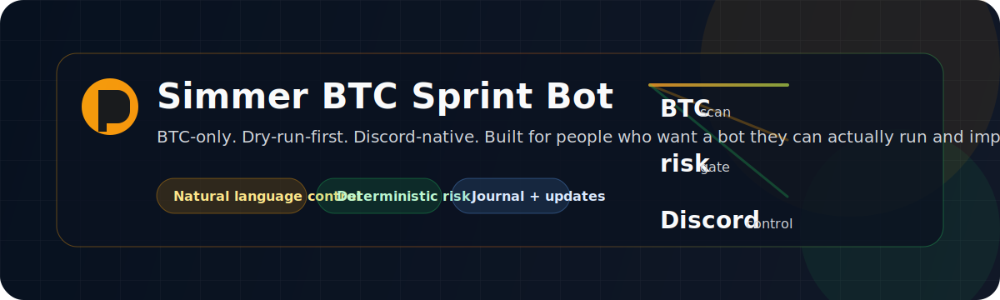

# Simmer BTC Sprint Bot

<p align="center">
  
</p>

> BTC-only. Dry-run-first. Discord-native. Built so other people can clone it, set their own secrets, and keep improving it.

Simmer BTC Sprint Bot is a live BTC sprint trading stack for Simmer. It scans markets, applies deterministic risk gates, writes every decision to a journal, and lets you control the bot in plain English from Discord.

## Why this repo is worth sharing

- Natural-language Discord control first, with `!` shortcuts as fallback
- BTC-focused market scanning and regime filtering
- Deterministic bankroll, slippage, and trade-count gates
- Trade journaling for review, export, and post-run analysis
- Morning briefings, alerts, and live status updates
- Portable install path with repo-relative defaults and env overrides

## How it works


## What it feels like in Discord

```text
you: what looks best right now?
bot: scanning BTC sprint markets...
bot: top candidate is X because liquidity is strong and the setup passed risk gates

you: run a cycle
bot: starting a dry-run cycle and logging the result

you: why did you skip that trade?
bot: it failed the bankroll and slippage checks
```

## What it can do

| Capability | What it gives you |
| --- | --- |
| Natural-language control | Mention the bot or start with `?` and speak normally. |
| BTC market scanning | Finds live BTC sprint candidates and highlights what looks interesting. |
| Deterministic risk gating | Enforces bankroll, slippage, position, and trade-count limits before execution. |
| Trade journaling | Stores each cycle and result for review and export. |
| Briefings and alerts | Sends morning summaries, live alerts, and heartbeat updates to Discord. |
| Update-friendly design | Keeps paths and startup behavior configurable for other machines. |

## Quick start

1. Read the install guide: [INSTALL.md](INSTALL.md)
2. Copy the example env file into your own secrets file and set your values.
3. Start the bot with [bin/start_btc_bot.sh](bin/start_btc_bot.sh).
4. Read the latest release notes in [CHANGELOG.md](CHANGELOG.md).

## Install and run

If you want the full setup flow, use [INSTALL.md](INSTALL.md).

Typical first-time flow:

```bash
git clone https://github.com/captainslab/captains-simmerbot.git
cd captains-simmerbot
python3 -m venv .venv
. .venv/bin/activate
pip install -r requirements.txt
cp .env.example "$HOME/.secrets/simmer-btc-sprint-bot.env"
bin/start_btc_bot.sh
```

## How to talk to it

Natural-language examples:

- "What looks best right now?"
- "Run a cycle"
- "Why did you skip that trade?"
- "Give me a morning briefing"
- "Show the last 20 trades"

Shortcut commands still work when you want a direct action:

| Command | Use |
| --- | --- |
| `!help` | Show the command list |
| `!status` | Show current performance and risk state |
| `!cycle` | Trigger one trading cycle |
| `!markets` | Scan live BTC markets |
| `!chart` | Show an ASCII PnL chart |
| `!export` | Export recent trades as CSV |
| `!briefing` | Generate a morning briefing |
| `!logs` | Tail a tmux log window |
| `!restart` | Restart the main bot process |
| `!stopall` | Stop running skills |
| `!alert` | Set a BTC price or win-rate alert |
| `!skill ...` | List, install, or stop skills |

## Demo mode and signals

The bot is designed to feel useful even when you are just watching it:

- Dry-run mode is the default.
- Every cycle is journaled.
- Discord messages show what happened and why.
- The morning briefing gives you a quick read on PnL, positions, and regime.

## Configuration

Set these in your local secrets file:

| Variable | Required | Purpose |
| --- | --- | --- |
| `SIMMER_API_KEY` | Yes | Authenticates against Simmer |
| `LLM_PROVIDER` | Yes | Chooses the model backend |
| `LLM_MODEL` | Yes | Sets the model name |
| `LLM_API_KEY` | Yes | Provider credential |
| `DISCORD_BOT_TOKEN` | Optional | Enables conversational Discord control |
| `DISCORD_WEBHOOK_URL` | Optional | Enables Discord alerts |
| `BTC_SPRINT_SECRETS_FILE` | Optional | Custom secrets file path |
| `BTC_SPRINT_PYTHON_BIN` | Optional | Custom Python binary path |
| `BTC_SPRINT_APPS_ROOT` | Optional | Custom apps root for tmux launches |
| `BTC_SPRINT_SKILL_LIBRARY` | Optional | Custom skill library path |
| `BTC_SPRINT_TMUX_SESSION` | Optional | Custom tmux session name |
| `BTC_SPRINT_TMUX_MAIN_WIN` | Optional | Custom tmux main window name |

## Keep it current

When you want the latest changes:

1. Pull the repo.
2. Reinstall dependencies if `requirements.txt` changed.
3. Re-run the tests.
4. Restart the loop.

The full update flow lives in [UPDATES.md](UPDATES.md).

## Repo map

| Path | Purpose |
| --- | --- |
| `skills/btc-sprint-stack/main.py` | Main loop and trade orchestration |
| `skills/btc-sprint-stack/modules/btc_discord_bot.py` | Discord conversation and commands |
| `skills/btc-sprint-stack/modules/btc_llm_decider.py` | Strict JSON LLM gate |
| `skills/btc-sprint-stack/modules/btc_heartbeat.py` | Briefings and cycle summaries |
| `skills/btc-sprint-stack/modules/btc_trade_journal.py` | Trade journal writer and reader |
| `skills/btc-sprint-stack/scripts/analyze_sprints.py` | Offline review of the journal |
| `INSTALL.md` | Step-by-step install guide |
| `UPDATES.md` | How to pull and ship updates safely |

## Safety model

- Default to dry-run.
- Keep BTC-only scope.
- Keep risk gates deterministic.
- Never commit secrets.
- Update tunables in the secret file, not the code, unless you are intentionally changing behavior.

## Contributing

If you improve the bot:

1. Make the change.
2. Run the tests.
3. Update the docs if behavior changed.
4. Commit and push.

That keeps the repo easy for other people to install, trust, and improve.
